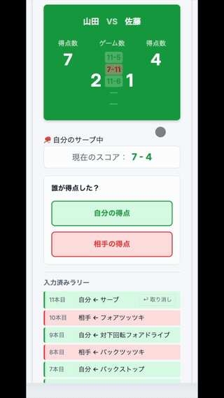
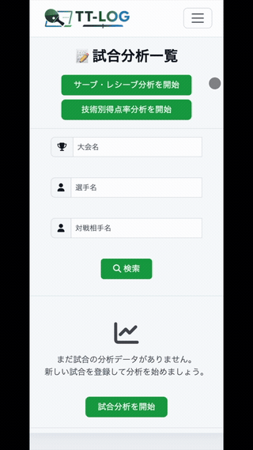
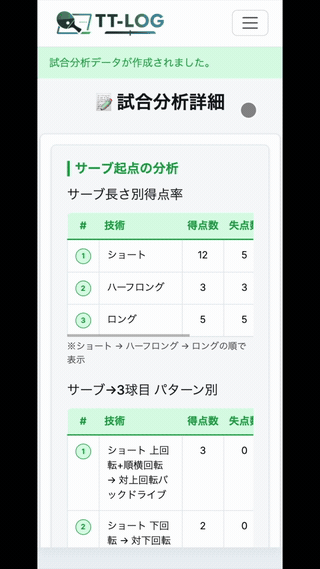
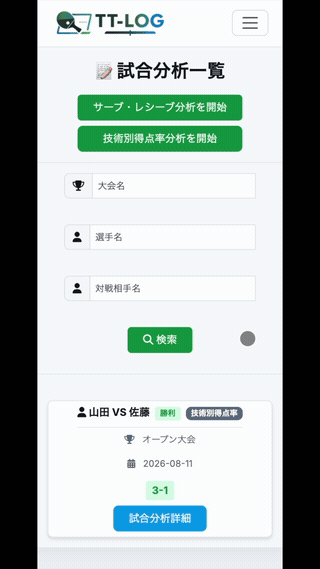
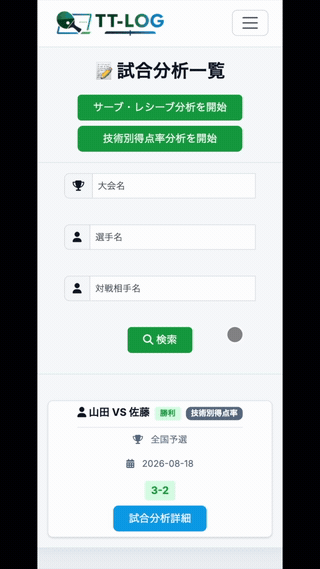
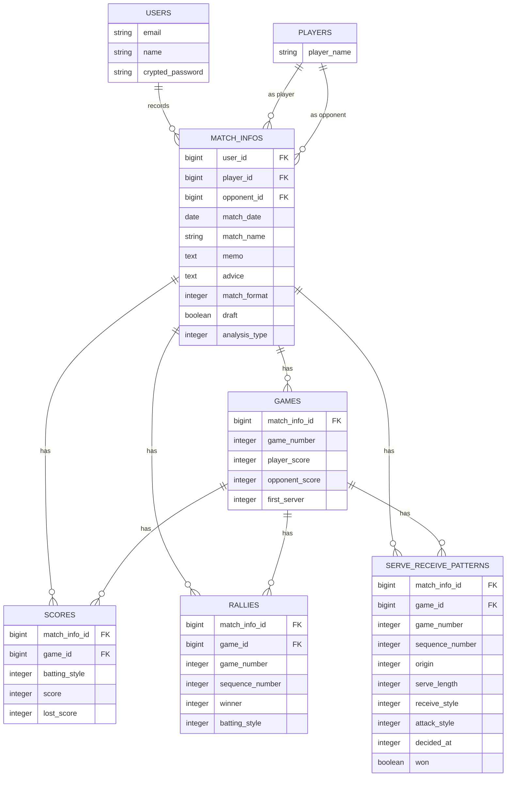

# プロジェクト名：[T.T.LOG]

 

# 目次
- [サービス概要](#サービス概要)
- [サービス開発の背景](#サービス開発の背景)
- [想定されるユーザー層](#想定されるユーザー層)
- [機能紹介](#機能紹介)
  - [試合分析機能](#試合分析機能)
  - [ゲームごとのスコア管理機能](#ゲームごとのスコア管理機能)
  - [サーブレシーブ分析機能](#サーブレシーブ分析機能)
  - [分析データの削除機能](#分析データの削除機能)
  - [分析データ検索機能](#分析データ検索機能)
  - [自動保存・中断機能](#自動保存中断機能)
  - [ユーザー機能](#ユーザー機能)
- [今後実装予定の機能](#今後実装予定の機能)
- [技術構成について](#技術構成について)
  - [使用技術](#使用技術)
  - [OpenAI APIのプロンプトについて](#openai-apiのプロンプトについて)
  - [ER図](#er図)
 
 

# サービス概要
**「AIが卓球の試合を分析し、プレー改善のヒントをくれる分析サービス」** 
T.T.LOGは、卓球の試合映像を見ながらラリーの結果を入力するだけで、得点率が自動集計され、生成AIから改善アドバイスがもらえる卓球専門の分析ツールです。

【サービスURL】 
https://www.ttlog.jp  

【ゲストユーザーアカウント情報】 
・ゲストユーザー1 
Email : ttlog.app+1@gmail.com 
Password : password  
・ゲストユーザー2 
Email : ttlog.app+2@gmail.com 
Password : password

 

# サービス開発の背景
私は小学生から現在に至るまでアマチュア選手として卓球を続けてきており、現在は一般の方に卓球を指導する仕事をしています。 
その経験の中で卓球をする方は「自分のプレーを客観視できておらず、必要のない練習をしてしまう」ことや「自分のプレーを見返してみてもどこが課題なのかわからない」などの課題感があります。 
そして卓球をする方は自分の試合を撮影して後で見返すという習慣が浸透しています。 
 
これらの課題感と習慣があることから撮影した動画を見ながら試合で使用した技術(フォアハンド・バックハンドなど)の得失点数をカウントしていくことでそれぞれの得点率が集計され、それに伴ったアドバイスがもらえるというサービスがあれば課題感の解決につながるのではないかと考えました。 
卓球の競技者が自身のプレーを客観視できて練習内容の効率化を図ることで成長スピードを促進させることができるサービスにしていきたいです。

 

# 想定されるユーザー層
- 老若男女問わず卓球が趣味で定期的に大会に参加に参加される方
- 自分の大会でのプレーを撮影して反省点を探す方
- 生徒の課題を分析したい指導者の方

 

# 💻機能紹介
## 📝試合分析機能
<table>
<thead>
<tr>
<th align="center">分析データ入力</th>
<th align="center">分析結果・詳細</th>
</tr>
</thead>
<tbody>
<tr>
<td align="center"></td>
<td align="center"></td>
</tr>
<tr>
<td align="center">
日程/大会名/選手名/対戦相手名/メモ/得点技術/失点技術を試合動画を見ながら記録していく。
</td>
<td align="center">
記録したデータを元に「技術の得点率ランキング表」と「技術に対するアドバイス」が生成されます。
</td>
</tr>
</tbody>
</table>

 

## 🏓ゲームごとのスコア管理機能
<table>
<thead>
<tr>
<th align="center">ゲームごとのスコア入力</th>
</tr>
</thead>
<tbody>
<tr>
<td align="center"></td>
</tr>
<tr>
<td align="center">
1ゲームごとに技術別の得点を記録すると、その場でスコアボードが更新され、ゲームごとの結果と勝敗数が一覧表示されます。入力ミスがあった場合はひとつ前のゲームまで戻ってやり直すことができます。
</td>
</tr>
</tbody>
</table>

 

## 🎯サーブレシーブ分析機能
<table>
<thead>
<tr>
<th align="center">サーブ・レシーブパターン入力</th>
<th align="center">分析結果・詳細</th>
</tr>
</thead>
<tbody>
<tr>
<td align="center"></td>
<td align="center"></td>
</tr>
<tr>
<td align="center">
サーブの長さ・回転と3球目の技術、レシーブの技術と4球目の技術をポイントごとに記録することで、「どのサーブ・レシーブから得点/失点しやすいか」を技術別得点率とは別軸で分析できます。
</td>
<td align="center">
記録したデータを元に「サーブ別・レシーブ別の得点率」「サーブ→3球目、レシーブ→4球目のパターン別得点率」「決着タイミングの分布」が集計され、サーブ・レシーブ戦術に特化したAIアドバイスが生成されます。
</td>
</tr>
</tbody>
</table>

 

## 📑分析データの削除機能
<table>
<thead>
<tr>
<th align="center">分析データの削除</th>
</tr>
</thead>
<tbody>
<tr>
<td align="center"></td>
</tr>
<tr>
<td align="center">
不要な分析データを削除することができます。
</td>
</tr>
</tbody>
</table>

 

## 🔍分析データ検索機能
<table>
<thead>
<tr>
<th align="center">分析データ検索</th>
</tr>
</thead>
<tbody>
<tr>
<td align="center"></td>
</tr>
<tr>
<td align="center">
大会名・選手名・対戦相手名を組み合わせて過去の分析データを検索できます。入力途中で過去に登録した名称の候補がオートコンプリートで表示されるため、表記ゆれを気にせずすばやく絞り込めます。
</td>
</tr>
</tbody>
</table>

 

## 💾自動保存・中断機能
試合の入力途中でブラウザを閉じてしまっても、入力内容は下書きとして自動保存されます。 
一覧ページから中断した試合を選ぶと、入力途中の状態から再開できます。

 

## 👨ユーザー機能
名前・メールアドレス・パスワード・パスワード確認を入力して会員登録し、登録したメールアドレスとパスワードでログインできます。「ログイン状態を保持する」にチェックを入れることでログイン状態が1ヶ月間継続します。 
ご高齢の方も使用してくださっており、パスワードの入力ミスが発生していたためパスワード表示切替ボタンを設置しました。

 

# 🔮今後実装予定の機能
「1試合を深く分析する」機能は完成度が高まってきたため、今後は複数試合をまたいだ成長分析へと発展させていく予定です。 
（内容は開発状況に応じて変更される場合があります）

## 📈 データ集計基盤・成長ダッシュボード
複数試合をまたいだ技術別得点率を、月別・週別の推移グラフで確認できるようにする予定です。「フォアドライブの得点率が半年でどう伸びたか」など、練習の成果を時系列で振り返れるようにします。

## 🥊 対戦相手タイプ別分析
対戦相手のタイプ（ドライブ型・カットマン・前陣速攻・ブロック型など）を登録できるようにし、タイプ別の勝率や技術別得点率を分析できるようにする予定です。サーブレシーブ分析と組み合わせることで、「カットマン相手の3球目決定率」のような分析も可能にしていきます。

## 🤖 AI長期メモリ・月間成長レポート
過去のアドバイスを踏まえた上で新しいアドバイスを生成する「専属AIコーチ」化を進め、月間の成長レポートや練習メニュー提案の自動生成を予定しています。

## 🏓 用具データ連携
ラケット・ラバーを変更した前後で得点率がどう変化したかを比較できる機能を検討しています。

## 👥 コミュニティ機能
得点率の伸びなど成長記録を共有し、クラブ単位やランキング形式で励まし合える機能を検討しています。

 

# 🔧技術構成について
## 使用技術
<table style="border-collapse: collapse; width: 100%; font-size: 15px;">
  <thead>
    <tr style="background-color: #1B5E20; color: #FFFFFF;">
      <th style="border: 2px solid #00B0FF; padding: 10px; text-align: center; width: 180px;">カテゴリ</th>
      <th style="border: 2px solid #00B0FF; padding: 10px; text-align: left;">技術内容</th>
    </tr>
  </thead>
  <tbody>
    <tr style="background-color: #F5F5F5;">
      <td style="border: 1px solid #00B0FF; padding: 8px; font-weight: bold;">開発環境</td>
      <td style="border: 1px solid #00B0FF; padding: 8px;">Docker</td>
    </tr>
    <tr>
      <td style="border: 1px solid #00B0FF; padding: 8px; font-weight: bold;">サーバーサイド</td>
      <td style="border: 1px solid #00B0FF; padding: 8px;">Ruby 3.2.10 / Rails 7.1.2</td>
    </tr>
    <tr style="background-color: #F5F5F5;">
      <td style="border: 1px solid #00B0FF; padding: 8px; font-weight: bold;">非同期処理</td>
      <td style="border: 1px solid #00B0FF; padding: 8px;">なし（コントローラーから同期呼び出し。Sidekiq/Redisは管理画面用の設定のみ残存）</td>
    </tr>
    <tr style="background-color: #F5F5F5;">
      <td style="border: 1px solid #00B0FF; padding: 8px; font-weight: bold;">認証機能</td>
      <td style="border: 1px solid #00B0FF; padding: 8px;">Sorcery</td>
    </tr>
    <tr style="background-color: #F5F5F5;">
      <td style="border: 1px solid #00B0FF; padding: 8px; font-weight: bold;">フロントエンド</td>
      <td style="border: 1px solid #00B0FF; padding: 8px;">JavaScript（importmap-rails）</td>
    </tr>
    <tr style="background-color: #F5F5F5;">
      <td style="border: 1px solid #00B0FF; padding: 8px; font-weight: bold;">CSSフレームワーク</td>
      <td style="border: 1px solid #00B0FF; padding: 8px;">
        Bootstrap 5.3.2（cssbundling-rails）
      </td>
    </tr>
    <tr style="background-color: #F5F5F5;">
      <td style="border: 1px solid #00B0FF; padding: 8px; font-weight: bold;">Web API</td>
      <td style="border: 1px solid #00B0FF; padding: 8px;">OpenAI API(モデル：gpt-5.4-mini)</td>
    </tr>
    <tr>
      <td style="border: 1px solid #00B0FF; padding: 8px; font-weight: bold;">インフラ</td>
      <td style="border: 1px solid #00B0FF; padding: 8px;">Heroku（Webサーバ） / PostgreSQL（DBサーバ）</td>
    </tr>
    <tr style="background-color: #F5F5F5;">
      <td style="border: 1px solid #00B0FF; padding: 8px; font-weight: bold;">その他</td>
      <td style="border: 1px solid #00B0FF; padding: 8px;">GitHub（VCS） / GitHub Actions（CI/CD）</td>
    </tr>
  </tbody>
</table>

 

## OpenAI APIのプロンプトについて
分析モードに応じて、それぞれ専用のプロンプトでOpenAI APIにアドバイス生成をリクエストしています。

### 技術別得点率分析のプロンプト
ラリー単位の記録（誰が・どの技術で得点/失点したか）を集計し、技術別得点効率・サーブレシーブ局面・ゲームごとの技術の流れ・得点/失点ラッシュ・接戦時の傾向などを添えてリクエストします。 
system role には以下を設定: 
「あなたは経験豊富な卓球コーチです。提供されるデータは実際の試合を1ラリーずつ記録したものです。各ラリーは『誰が得点したか（自分or相手）』と『そのラリーを決めた技術名』を記録しています。データを深く分析し、選手が次の練習・試合で即座に実践できる具体的なアドバイスを作成してください。」 
user role では上記の集計データに加え、次の6項目のフォーマットでのアドバイス生成を指示します:
  - 【サーブ戦術の改善】
  - 【レシーブ戦術の改善】
  - 【得意技術の活用戦略】
  - 【弱点・課題技術の改善方法】
  - 【試合の流れ・ラッシュへの対処法】
  - 【接戦・デュースで勝ち切るための技術選択】

### サーブレシーブ分析のプロンプト
サーブ/レシーブの起点別に、サーブの長さ・回転、3球目/4球目の技術、決着タイミングと勝敗を集計してリクエストします。 
system role には「提供データにない事象（相手の具体的な技術など）を推測で創作しないでください」といった制約を明示し、サーブ・レシーブ戦術の改善に特化したアドバイスを生成するよう指示しています。 
user role では集計データとともに、次の6項目のフォーマットでのアドバイス生成を指示します:
  - 【サーブ戦術の強化】
  - 【レシーブ戦術の強化】
  - 【3球目攻撃の改善】
  - 【4球目攻撃の改善】
  - 【得点タイミングの活用】
  - 【試合全体の戦略的アドバイス】

 

## ER図

```mermaid
erDiagram
    USERS ||--o{ MATCH_INFOS : "records"
    PLAYERS ||--o{ MATCH_INFOS : "as player"
    PLAYERS ||--o{ MATCH_INFOS : "as opponent"
    MATCH_INFOS ||--o{ GAMES : "has"
    MATCH_INFOS ||--o{ SCORES : "has"
    MATCH_INFOS ||--o{ RALLIES : "has"
    MATCH_INFOS ||--o{ SERVE_RECEIVE_PATTERNS : "has"
    GAMES ||--o{ SCORES : "has"
    GAMES ||--o{ RALLIES : "has"
    GAMES ||--o{ SERVE_RECEIVE_PATTERNS : "has"

    USERS {
        string email
        string name
        string crypted_password
    }
    PLAYERS {
        string player_name
    }
    MATCH_INFOS {
        bigint user_id FK
        bigint player_id FK
        bigint opponent_id FK
        date match_date
        string match_name
        text memo
        text advice
        integer match_format
        boolean draft
        integer analysis_type
    }
    GAMES {
        bigint match_info_id FK
        integer game_number
        integer player_score
        integer opponent_score
        integer first_server
    }
    SCORES {
        bigint match_info_id FK
        bigint game_id FK
        integer batting_style
        integer score
        integer lost_score
    }
    RALLIES {
        bigint match_info_id FK
        bigint game_id FK
        integer game_number
        integer sequence_number
        integer winner
        integer batting_style
    }
    SERVE_RECEIVE_PATTERNS {
        bigint match_info_id FK
        bigint game_id FK
        integer game_number
        integer sequence_number
        integer origin
        integer serve_length
        integer receive_style
        integer attack_style
        integer decided_at
        boolean won
    }
```

 
