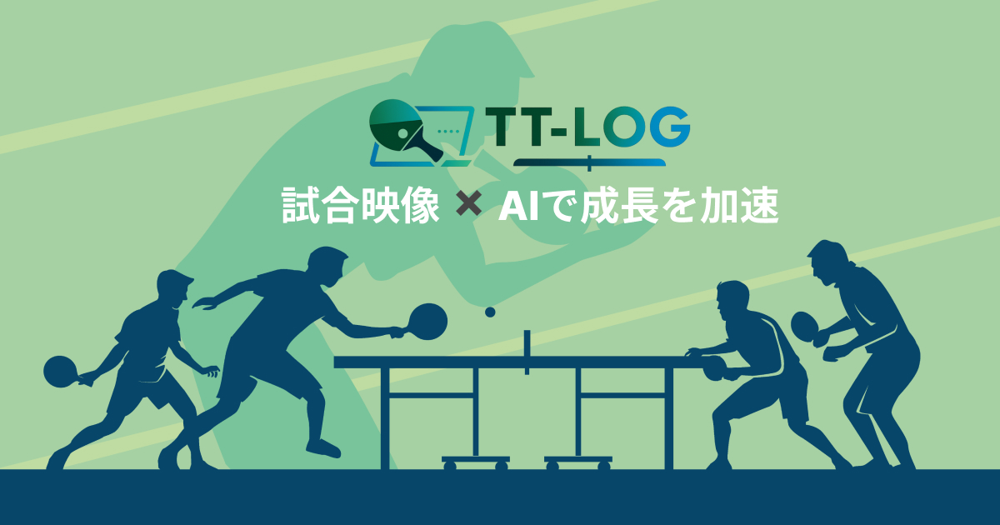

# プロジェクト名：[T.T.LOG]

# 目次
- [サービス概要](#サービス概要)
- [サービス開発の背景](#サービス開発の背景)
- [想定されるユーザー層](#想定されるユーザー層)
- [機能紹介](#機能紹介)
  - [試合分析機能](#試合分析機能)
  - [分析データの編集・削除機能](#分析データの編集削除機能)
  - [ユーザー機能](#%E2%80%8D%EF%B8%8Fユーザー機能)
  - [分析データ検索機能](#分析データ検索機能)
- [技術構成について](#技術構成について)
  - [使用技術](#使用技術)
  - [OpenAI APIのプロンプトについて](#openai-apiのプロンプトについて)
  - [ER図](#er図)
  - [画面遷移図](#画面遷移図)

# サービス概要
T.T.LOGは卓球の試合映像を見ながらラリーの最後にどの技術(フォアハンド・バックハンドなど)で得点したか、または失点したかをカウントしていくことでそれぞれの得点率が自動集計され、生成AIからそのデータに伴ったアドバイスがもらえる卓球専門の試合分析サービスです。

【サービスURL】 
https://www.ttlog.jp  

【ゲストユーザーアカウント情報】 
・ゲストユーザー1 
Email : ttlog.app+1@gmail.com 
Password : password  
・ゲストユーザー2 
Email : ttlog.app+2@gmail.com 
Password : password

# サービス開発の背景
私は小学生から現在に至るまでアマチュア選手として卓球を続けてきており、現在は一般の方に卓球を指導する仕事をしています。 
その経験の中で卓球をする方は「自分のプレーを客観視できておらず、必要のない練習をしてしまう」ことや「自分のプレーを見返してみてもどこが課題なのかわからない」などの課題感があります。 
そして卓球をする方は自分の試合を撮影して後で見返すという習慣が浸透しています。 
これらの課題感と習慣があることから撮影した動画を見ながら試合で使用した技術(フォアハンド・バックハンドなど)の得失点数をカウントしていくことでそれぞれの得点率が集計され、それに伴ったアドバイスがもらえるというサービスがあれば課題感の解決につながるのではないかと考えました。 
卓球の競技者が自身のプレーを客観視できて練習内容の効率化を図ることで成長スピードを促進させることができるサービスにしていきたいです。

# 想定されるユーザー層
老若男女問わず卓球が趣味で定期的に大会に参加に参加される方。 
自分の大会でのプレーを撮影して反省点を探す方。

# 💻機能紹介
## 📝試合分析機能
<table>
<thead>
<tr>
<th align="center">分析データ入力</th>
<th align="center">分析結果・詳細</th>
</tr>
</thead>
<tbody>
<tr>
<td align="center"></td>
<td align="center"></td>
</tr>
<tr>
<td align="center">
日程/大会名/選手名/対戦相手名/メモ/得点技術/失点技術を試合動画を見ながら記録していく。
</td>
<td align="center">
記録したデータを元に「技術の得点率ランキング表」と「技術に対するアドバイス」が生成されます。
</td>
</tr>
</tbody>
</table>

## 📑分析データの編集・削除機能
<table>
<thead>
<tr>
<th align="center">分析データの編集</th>
<th align="center">分析データの削除</th>
</tr>
</thead>
<tbody>
<tr>
<td align="center"></td>
<td align="center"></td>
</tr>
<tr>
<td align="center">
分析データを編集して得点率ランキングやアドバイスを再生成することができます。
</td>
<td align="center">
不要な分析データを削除することができます。
</td>
</tr>
</tbody>
</table>

## 👨ユーザー機能
<table>
<thead>
<tr>
<th align="center">会員登録</th>
<th align="center">ログイン</th>
</tr>
</thead>
<tbody>
<tr>
<td align="center"></td>
<td align="center"></td>
</tr>
<tr>
<td align="center">
名前・メールアドレス・パスワード・パスワード確認を入力し会員登録をします。ご高齢の方も使用してくださっていてパスワードの入力ミスが発生してしまっていたのでパスワード表示切替ボタンを設置しました。
</td>
<td align="center">
登録したメールアドレスとパスワードでログインします。「ログイン状態を保持する」にチェックを入れることでログイン状態が1ヶ月間継続します。
</td>
</tr>
</tbody>
</table>

## 🔍分析データ検索機能
<table>
<thead>
<tr>
<th align="center">分析データ検索(サジェストなし)</th>
</tr>
</thead>
<tbody>
<tr>
<td align="center"></td>
</tr>
<tr>
<td align="center">
大会名・選手名・対戦相手名を組み合わせて過去の分析データを検索できます。
</td>
</tr>
</tbody>
</table>

# 🧑‍💻技術構成について
## 使用技術
<table style="border-collapse: collapse; width: 100%; font-size: 15px;">
  <thead>
    <tr style="background-color: #1B5E20; color: #FFFFFF;">
      <th style="border: 2px solid #00B0FF; padding: 10px; text-align: center; width: 180px;">カテゴリ</th>
      <th style="border: 2px solid #00B0FF; padding: 10px; text-align: left;">技術内容</th>
    </tr>
  </thead>
  <tbody>
    <tr style="background-color: #F5F5F5;">
      <td style="border: 1px solid #00B0FF; padding: 8px; font-weight: bold;">開発環境</td>
      <td style="border: 1px solid #00B0FF; padding: 8px;">Docker</td>
    </tr>
    <tr>
      <td style="border: 1px solid #00B0FF; padding: 8px; font-weight: bold;">サーバーサイド</td>
      <td style="border: 1px solid #00B0FF; padding: 8px;">Ruby 3.2.2 / Rails 7.1.2</td>
    </tr>
    <tr style="background-color: #F5F5F5;">
      <td style="border: 1px solid #00B0FF; padding: 8px; font-weight: bold;">認証機能</td>
      <td style="border: 1px solid #00B0FF; padding: 8px;">Sorcery</td>
    </tr>
    <tr>
      <td style="border: 1px solid #00B0FF; padding: 8px; font-weight: bold;">検索・オートコンプリート</td>
      <td style="border: 1px solid #00B0FF; padding: 8px;">Stimulus Autocomplete（Rails7）</td>
    </tr>
    <tr style="background-color: #F5F5F5;">
      <td style="border: 1px solid #00B0FF; padding: 8px; font-weight: bold;">フロントエンド</td>
      <td style="border: 1px solid #00B0FF; padding: 8px;">JavaScript（importmap-rails）</td>
    </tr>
    <tr>
      <td style="border: 1px solid #00B0FF; padding: 8px; font-weight: bold;">CSSフレームワーク</td>
      <td style="border: 1px solid #00B0FF; padding: 8px;">Bootstrap 5.3.2（cssbundling-rails）</td>
    </tr>
    <tr style="background-color: #F5F5F5;">
      <td style="border: 1px solid #00B0FF; padding: 8px; font-weight: bold;">Web API</td>
      <td style="border: 1px solid #00B0FF; padding: 8px;">OpenAI API</td>
    </tr>
    <tr>
      <td style="border: 1px solid #00B0FF; padding: 8px; font-weight: bold;">インフラ</td>
      <td style="border: 1px solid #00B0FF; padding: 8px;">Heroku（Webサーバ） / PostgreSQL（DBサーバ）</td>
    </tr>
    <tr style="background-color: #F5F5F5;">
      <td style="border: 1px solid #00B0FF; padding: 8px; font-weight: bold;">その他</td>
      <td style="border: 1px solid #00B0FF; padding: 8px;">GitHub（VCS） / GitHub Actions（CI/CD）</td>
    </tr>
  </tbody>
</table>

## OpenAI APIのプロンプトについて
技術別の得点数と失点数を集計後に下記のプロンプトでOpenAI APIに分析リクエスト。 
以下は卓球の1試合で使用した技術ごとの得点数と失点数データです。このデータを基に、次の項目について日本語で簡潔にアドバイスを作成してください。 
なお、フォアプッシュはフォアツッツキ、バックプッシュはバックツッツキと表示してください。 
  - 【得点が多く失点が少ない技術の活用方法】
  - 【得点が多いが失点も多い技術の改善方法】
  - 【得点が少なく失点が多い技術の改善方法】
  - 【使用頻度が低い技術や未使用技術の導入方法】

## ER図

## 画面遷移図
https://www.figma.com/file/MJdJwaQDsET1HkfhQ1KO25/RUNTEQ%E7%94%BB%E9%9D%A2%E9%81%B7%E7%A7%BB%E5%9B%B3?type=design&node-id=427-798&mode=design&t=rC1St5srpN7nLmEV-0
